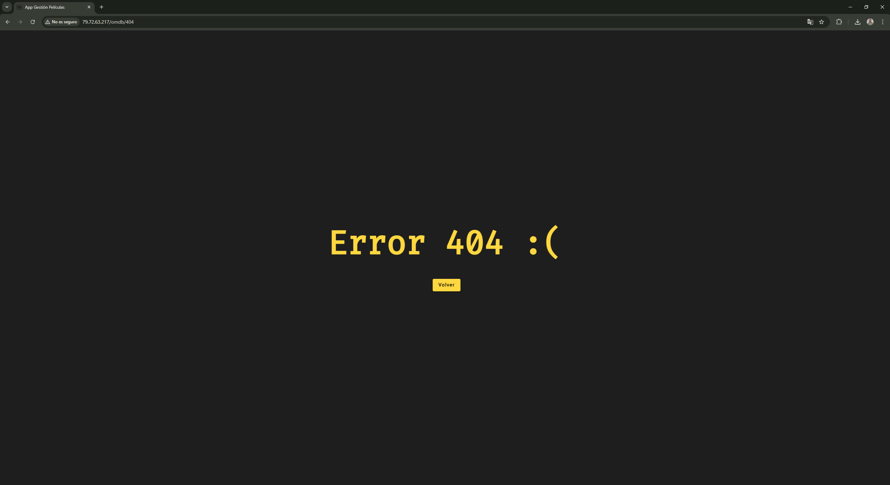

# 🎬 Movie Management Application

This project is built with Angular, uses a PHP backend, and stores data in a MySQL database. It allows users to search for movies, mark them as favorites, and—if they have admin permissions—manage user accounts.

---

## ✨ Main Features

- 🔐 **Two-step login**
- 🔎 **Movie search** using [TheMovieDB](https://www.themoviedb.org/) API
- ⭐ **Favorites management**
- 👤 **User management** (admin only)
- 🧭 **Sidebar navigation**
- 🚪 **Logout and session control**
- ❌ **Custom 404 error page**

---

## 🖼️ Screenshots

### 🔐 Login Page (Step 1 and 2)
  


### 🔍 Search Page with Results


### 📂 Sidebar Navigation


### ⭐ Favorites Page


### 👤 Admin User Management


### ❌ Error 404



---

## 🧩 Project Architecture

### 🔐 `auth` Module
- Handles login and session control.
- Includes **guards** to restrict access based on login status.
- Redirects to the movie module after login.

### 🎞️ `peliculas` Module
- Displays the main search page and movie detail pages.
- Allows adding/removing movies from favorites.
- Includes a toolbar with logout and sidebar access.

### 👥 `usuarios` Module
- Only accessible to administrators.
- Fully functional CRUD for user records.

---

## 🗃️ Database

### 🎞️ Movie Favorites Table

Favorites are stored in the `peliculas_favoritas` table:

```sql
CREATE TABLE peliculas_favoritas (
  id_fav INT AUTO_INCREMENT PRIMARY KEY,
  id_pelicula INT NOT NULL,
  id_usuario INT NOT NULL
);
```

## 👥 User Table Schema

User information is stored in the `sgi_usuarios` table, with the following structure:

```sql
CREATE TABLE `sgi_usuarios` (
  `id_usuario` int(11) NOT NULL AUTO_INCREMENT,
  `usuario` varchar(100) NOT NULL,
  `nombre_publico` varchar(255) DEFAULT NULL,
  `pass_user` varchar(100) NOT NULL,
  `id_rol` int(11) DEFAULT NULL,
  `habilitado` tinyint(1) DEFAULT 1,
  `token_sesion` varchar(250) DEFAULT NULL,
  `token_passwd` varchar(255) DEFAULT NULL,
  `token_passwd_expira` datetime DEFAULT NULL,
  `observaciones` text DEFAULT NULL,
  PRIMARY KEY (`id_usuario`),
  UNIQUE KEY `token_sesion` (`token_sesion`),
  KEY `id_rol` (`id_rol`),
  CONSTRAINT `sgi_usuarios_ibfk_1` FOREIGN KEY (`id_rol`) REFERENCES `sgi_roles` (`id_rol`) ON UPDATE NO ACTION
) ENGINE=InnoDB AUTO_INCREMENT=67 DEFAULT CHARSET=latin1 COLLATE=latin1_swedish_ci;
```

This table is used for user login, public display name, role-based permissions, and session control.

---

## 🌐 External API

Movie data is retrieved using the [TheMovieDB](https://www.themoviedb.org/) public API.

Example response:

```json
{
  "id": 242582,
  "title": "Nightcrawler",
  "overview": "When Lou Bloom...",
  "poster_path": "/image.jpg",
  ...
}
```

---

## 🛡️ Security & Access Control

- Authentication based on JWT tokens stored in `localStorage`.
- Role-based access control for admin-only features.
- Automatic redirection for unauthorized access attempts.
- Logout clears the token and session data.

---

## ⚠️ Custom 404 Page

Users navigating to nonexistent routes are redirected to a custom 404 error page.

---

## 👨‍💻 Author

**Oscar Montero Hinojosa**  
User Interface Development and Business Management System – Final Project

---

