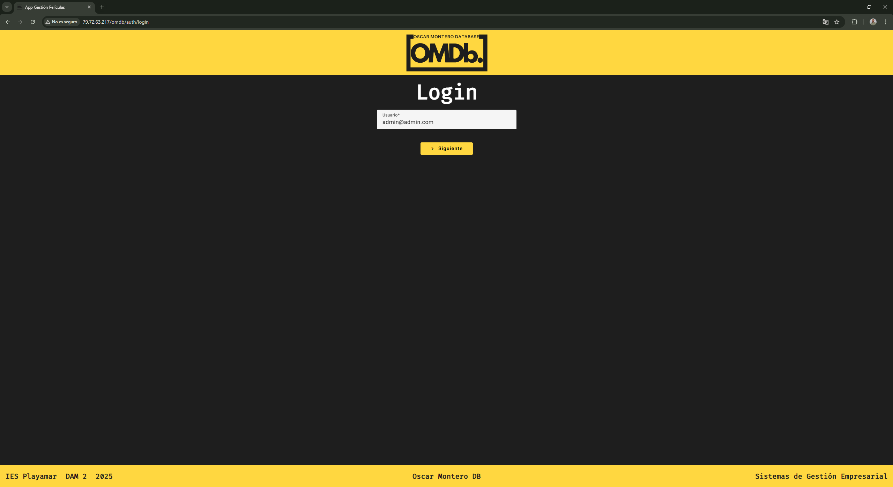
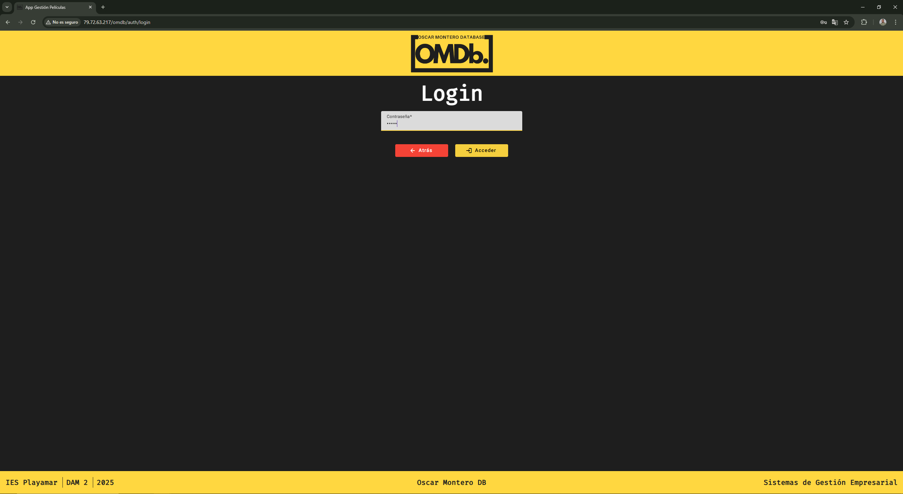
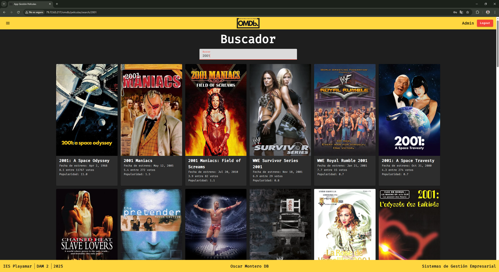
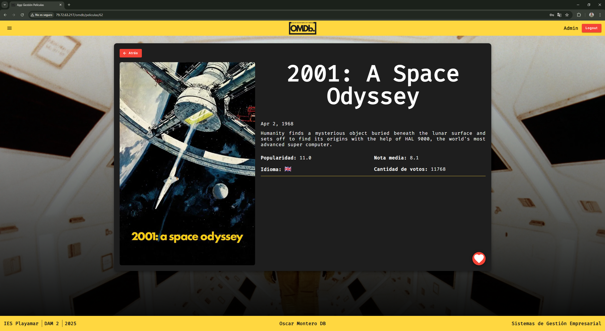
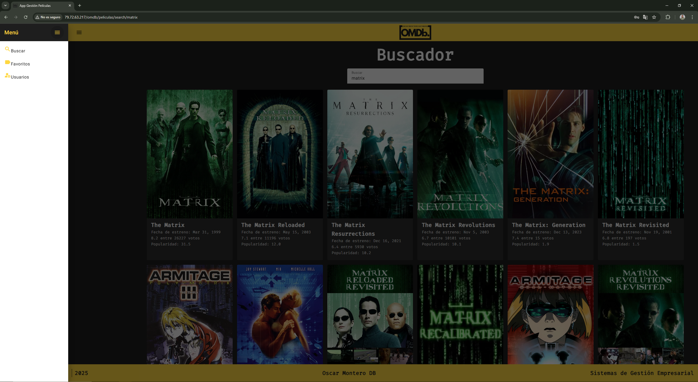
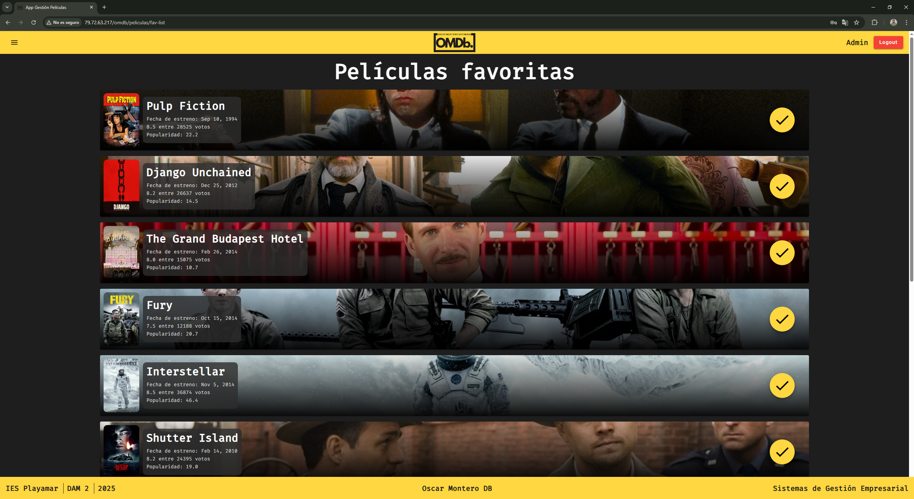
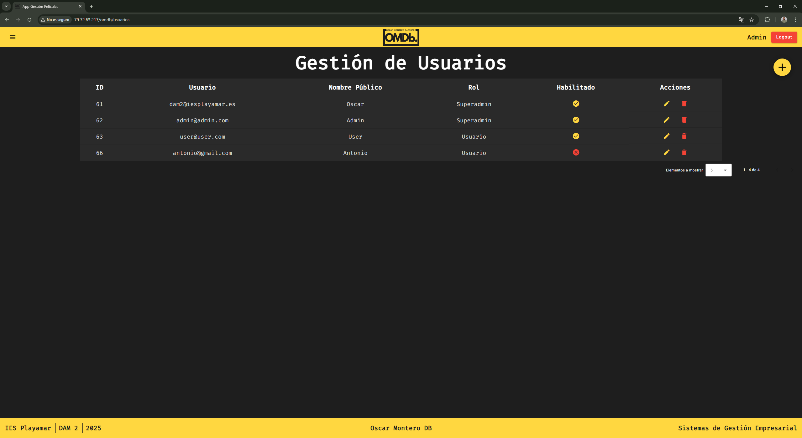
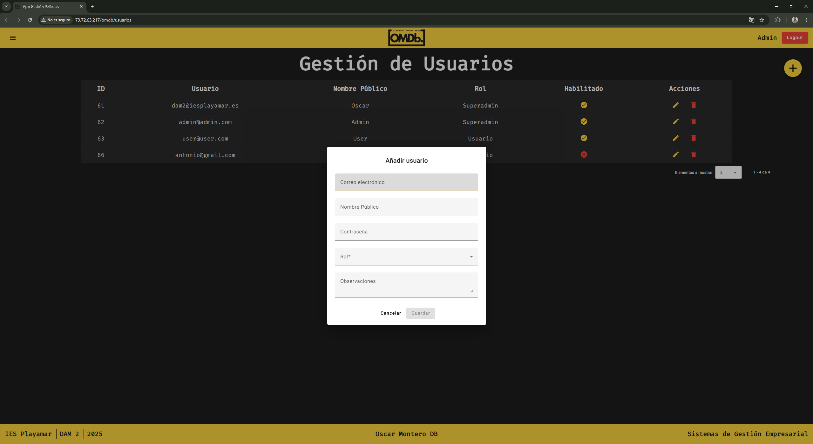
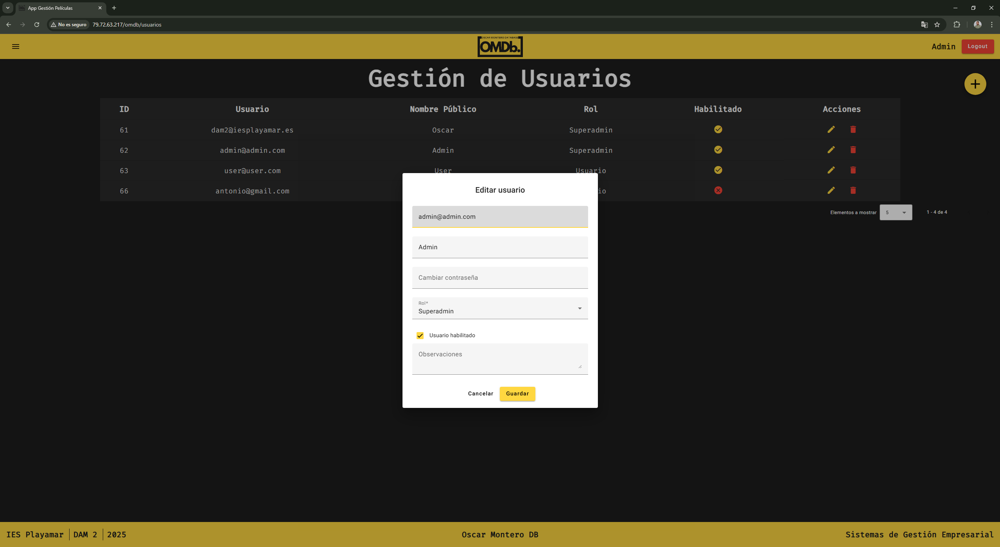

# 🎬 Movie Management Application

This project is built with Angular, uses a PHP backend, and stores data in a MySQL database. It allows users to search for movies, mark them as favorites, and—if they have admin permissions—manage user accounts.

---

## ✨ Main Features

- 🔐 **Two-step login**
- 🔎 **Movie search** using [TheMovieDB](https://www.themoviedb.org/) API
- ⭐ **Favorites management**
- 👤 **User management** (admin only)
- 🧭 **Sidebar navigation**
- 🚪 **Logout and session control**
- ❌ **Custom 404 error page**

---

## 🖼️ Screenshots

### 🔐 Login Page (Step 1 and 2)
  


### 🔍 Search Page with Results



### 📂 Sidebar Navigation


### ⭐ Favorites Page


### 👤 Admin User Management





---

## 🧩 Project Architecture

### 🔐 `auth` Module
- Handles login and session control.
- Includes **guards** to restrict access based on login status.
- Redirects to the movie module after login.

### 🎞️ `peliculas` Module
- Displays the main search page and movie detail pages.
- Allows adding/removing movies from favorites.
- Includes a toolbar with logout and sidebar access.

### 👥 `usuarios` Module
- Only accessible to administrators.
- Fully functional CRUD for user records.

---

## 🗃️ Database

Favorites are stored in the `peliculas_favoritas` table:

```sql
CREATE TABLE peliculas_favoritas (
  id_fav INT AUTO_INCREMENT PRIMARY KEY,
  id_pelicula INT NOT NULL,
  id_usuario INT NOT NULL
);
